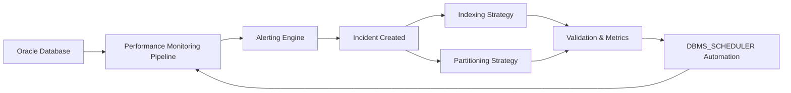
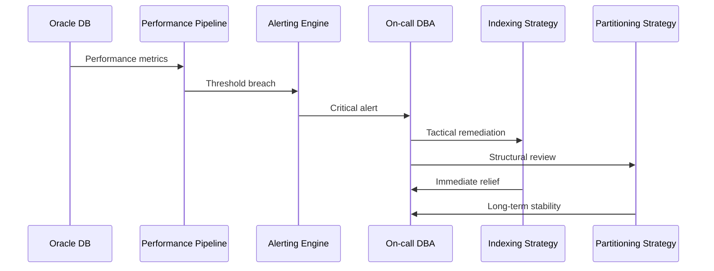

# 🛠️ Oracle DBA Automation & Incident Response Series

A production-style **Oracle DBA portfolio series** demonstrating how enterprise databases are **monitored, diagnosed, remediated, and stabilized under real incident conditions**.

This is not a collection of isolated scripts.
It is an **end-to-end operational system**, designed the way experienced DBAs actually work in production.

---

## 🎯 Purpose of This Series

In enterprise environments, DBAs are expected to:

* Respond quickly to performance incidents
* Diagnose issues under pressure
* Protect critical workloads
* Enforce governance and SLAs
* Automate repeatable operational tasks

This series showcases those capabilities through **practical, script-driven solutions**.

---

## 🛠️ Technologies Across the Series

* Oracle Database internals (V$ views, AWR, Resource Manager)
* SQL / PL/SQL
* Python (automation, parsing, analytics)
* Shell scripting
* Linux scheduling (cron)

---

## 🧭 How to Navigate This Portfolio

Each repository represents a **distinct operational layer** in the DBA lifecycle.

**Recommended reading order:**

1. **Performance Monitoring Pipeline** → detect problems early
2. **Alerting Engine** → decide when and how to respond
3. **Indexing Strategy** → tactical, low-risk remediation
4. **Partitioning Strategy** → structural, long-term optimization
5. **DBMS_SCHEDULER Automation** → prevention and repeatability
6. **Incidents & Runbooks** → operational maturity and on-call readiness

Every optimization is:

* Triggered by evidence
* Linked to an incident
* Validated with metrics
* Designed with rollback in mind

---

## 🧱 Series Architecture Overview

### End-to-End Automation Flow

📌 **Closed-loop design:** detect → decide → remediate → validate → prevent recurrence.

---

## 🔁 Incident-Driven Response Model

This mirrors **real on-call DBA behavior** in enterprise environments.

---

## 📦 Repositories in This Series

### 🔍 Performance Monitoring Pipeline

**Purpose:** Detect performance degradation early
**Focus:** CPU, IO, waits, sessions, locks
➡️ Feeds metrics into the alerting layer

---

### 🚨 Alerting Engine

**Purpose:** Decide when metrics become incidents
**Focus:** Thresholds, severity, incident creation
➡️ Triggers remediation workflows

---

### ⚡ Oracle Indexing Strategy

**Purpose:** Immediate, low-risk performance relief
**Focus:** Missing indexes, unused indexes, CPU-heavy SQL
➡️ Tactical fix during live incidents

---

### 🧱 Oracle Partitioning Strategy

**Purpose:** Structural, long-term optimization
**Focus:** Large tables, growth trends, pruning
➡️ Prevents repeat incidents

---

### ⏱️ DBMS_SCHEDULER Automation

**Purpose:** Make fixes repeatable and preventative
**Focus:** Scheduled reviews, job chains, maintenance windows
➡️ Reduces manual DBA workload

---

### 📋 Incidents & Runbooks

**Purpose:** Show operational maturity
**Focus:** Real incident reports, decision logic, on-call steps
➡️ Demonstrates production readiness

---

## 🧠 Design Principles

This series is built on the following principles:

* **Evidence before action**
* **Lowest-risk fix first**
* **Rollback always prepared**
* **Automation supports judgment**
* **Every change traceable to an incident**

No blind tuning. No guesswork.

---

## 📊 Indexing vs Partitioning (Decision Summary)

| Scenario                  | Preferred Action        |
| ------------------------- | ----------------------- |
| Immediate CPU spike       | Indexing                |
| Repeated full scans       | Indexing → Partitioning |
| Very large growing tables | Partitioning            |
| Quick rollback required   | Indexing                |
| Long-term stability       | Partitioning            |

> **Stabilize first. Optimize second.**

---

## 🚨 Operational Readiness

This portfolio demonstrates:

* On-call DBA decision-making
* Incident documentation & RCA
* Safe production changes
* Validation and metrics-driven proof
* Preventive automation

It reflects how databases are actually run — not how textbooks describe them.

---

## 🎯 Who This Portfolio Is For

This series is designed to demonstrate readiness for:

* Senior Oracle DBA roles
* Principal / Lead DBA positions
* SRE / Production Engineering roles
* High-availability enterprise environments

---

## 🚀 Future Roadmap

Planned additions to the series:

* Alerting & notifications (email / Slack)
* PDB-level resource management
* Centralized logging integration
* Advanced workload automation
* CI-driven validation pipelines

---

## 📌 Final Note

This repository is the **index and narrative glue** for the entire automation series.

Together, these projects answer one question clearly:

> **“Can this person run a production Oracle database under pressure?”**
